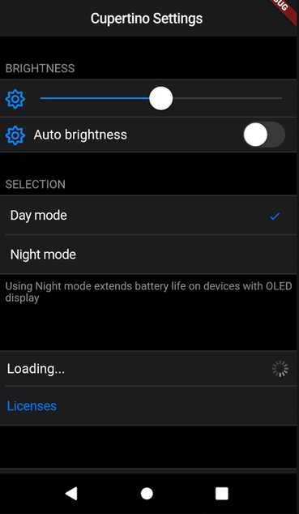

# flutter_cupertino_settings

 

A Flutter widget to create an iOS settings-table (static TableView).

[Get from Pub](https://pub.dartlang.org/packages/flutter_cupertino_settings#-installing-tab-)

- [x] Basic items (CSHeader, CSWidget, CSControl, CSButton, CSLink, CSDescription)
- [x] Support for icons
- [x] Item selection
- [x] Themes

```dart

import 'package:flutter_cupertino_settings/flutter_cupertino_settings.dart';

CSWidgetStyle brightnessStyle = const CSWidgetStyle(
    icon: const Icon(Icons.brightness_medium, color: Colors.black54)
);

CupertinoSettings(
    items: <Widget>[
        const CSHeader('Brightness'),
        CSWidget(CupertinoSlider(value: 0.5), style: brightnessStyle),
        CSControl(
            nameWidget: Text('Auto brightness'),
            contentWidget: CupertinoSwitch(value: true), 
            style: brightnessStyle,
        ),
        CSHeader('Selection'),
        CSSelection<int>(
            items: const <CSSelectionItem<int>>[
                CSSelectionItem<int>(text: 'Day mode', value: 0),
                CSSelectionItem<int>(text: 'Night mode', value: 1),
            ],
            onSelected: (index) {print(index);},
            currentSelection: 0,
        ),
        CSDescription('Using Night mode extends battery life on devices with OLED display',),
        const CSHeader(''),
        CSControl(
            nameWidget: Text('Loading...'), 
            contentWidget: CupertinoActivityIndicator(),
        ),
        CSButton(CSButtonType.DEFAULT, "Licenses", (){ print("It works!"); }),
        const CSHeader(''),
        CSButton(CSButtonType.DESTRUCTIVE, "Delete all data", (){})
    ]
);
```



### Contributors
- Dark theme & example by [AppleEducate](https://github.com/appleeducate)
- CSSecret by [SimonIT](https://github.com/SimonIT)
- iOS 13 support by [Tim Bierbaum](https://github.com/bierbaumtim)